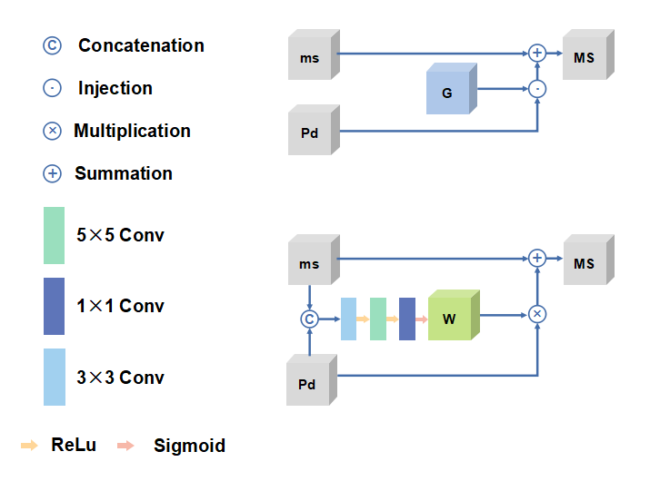
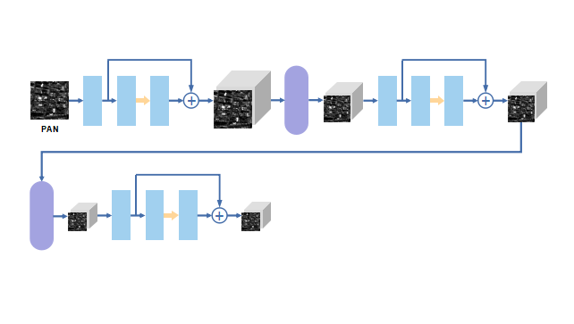
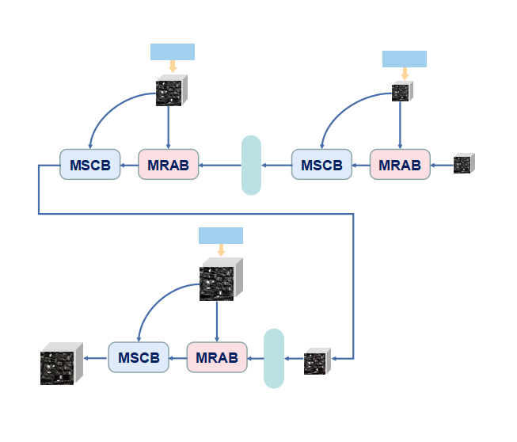
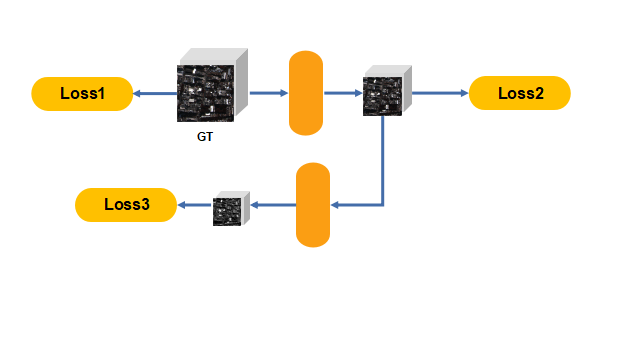
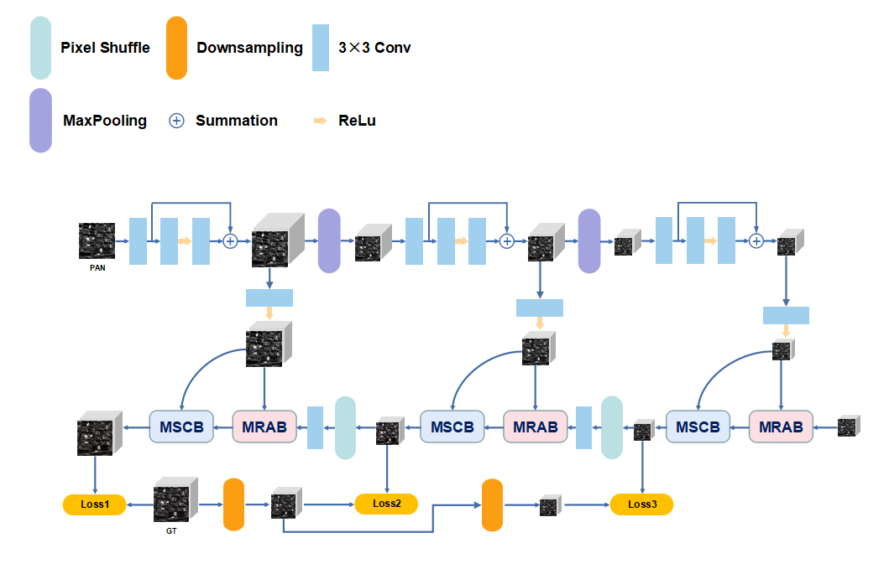

# 依赖项和安装
- Python 3.8 (Recommend to use [Anaconda](https://www.anaconda.com/))
- Pytorch 2.1.0
- NVIDIA GPU + CUDA
- Python packages: `pip install numpy scipy h5py`
- TensorBoard

# 数据集准备

​	在这项工作中，我们主要在WorldView-3数据集上进行网络训练，这些数据集可以在网站上下载 WorldView-3（可[在此处](https://www.maxar.com/product-samples/)下载）、QuickBird（可[在此处](https://earth.esa.int/eogateway/catalog/quickbird-full-archive)下载）和高分 2 号（可[在此处](http://www.rscloudmart.com/dataProduct/sample)下载）由于数据集的版权，我们无法上传数据集，您可以下载数据并根据代码进行模拟。

# 开始使用

-   训练和测试代码位于当前文件夹中。
    - 用于训练的代码是 train.py，而用于测试一张图像 （.mat） 的代码是 main_test_single.py，我们还提供了预训练模型 “pretrained.pth”。
    - 对于训练，你需要在 main 函数中设置 file_path，也要 adopt to your train set、validate set 和 test set。我们的代码训练 .h5 文件，您可以通过更改 main 函数中的代码来更改它。
    - 至于测试，你需要在 main 和 test function 中都设置路径来打开和加载文件。

# 方法

 ***MRA B模块：***

***PAN模块：***

***MS模块：***

***损失函数模块：***

设分别表示第一级，第二级和第三级的输出，分别表示第一级，第二级和第三级的GT图像。我们为这三个层次的监督学习定义了以下损失函数:

其中a，b∈[0，1]在训练阶段是一个常数。具体来说，Loss1，Loss2和Loss3的定义如下: 

式中表示第一范数，N为训练样本数。

***网络整体架构：***

***视觉结果：***在降低分辨率的 Rio 数据集（传感器：WorldView-3）上所有比较方法的视觉比较。

| **GT** | **MTF-GLP-FS** | **MTF-GLP-HPM-R** |

| **BDSD-PC** | **BT-H** | **NEWNet** |

***以下是在细节上进行展示***

| **GT** | **MTF-GLP-FS** | **MTF-GLP-HPM-R** |

| **BDSD-PC** | **BT-H** | **NEWNet** |

***定量结果：***以下定量结果是从 WorldView-3 数据集生成的

**表** **1**  **数据结果**

| Method      | Q_index     | Q2n_index   | SAM_index   | ERGAS_index | SCC         |
| ----------- | ----------- | ----------- | ----------- | ----------- | ----------- |
| BT-H        | 0.849114291 | 0.828508872 | 7.035076080 | 6.919027164 | 0.766316654 |
| BDSD-PC     | 0.840725511 | 0.817092651 | 7.720848084 | 7.135904138 | 0.741612817 |
| MTF-GLP     | 0.845755774 | 0.832807554 | 7.876552711 | 6.918594588 | 0.751471576 |
| MTF-GLP-FS  | 0.842108567 | 0.827975392 | 7.741791797 | 6.996835006 | 0.742178631 |
| New Net     | 0.931221794 | 0.917696419 | 6.611537635 | 4.038355202 | 0.944996224 |
| Ideal value | 1           | 1           | 0           | 0           | 1           |

**表** **2** **平均数据结果**

| Method      | Q_index     | Q2n_index   | SAM_index   | ERGAS_index | SCC         |
| ----------- | ----------- | ----------- | ----------- | ----------- | ----------- |
| BT-H        | 0.834179574 | 0.820706607 | 5.604653052 | 4.762141579 | 0.784225836 |
| BDSD-PC     | 0.823189064 | 0.814622206 | 7.712863954 | 4.90236813  | 0.752338718 |
| MTF-GLP     | 0.819505162 | 0.822077671 | 8.078482025 | 6.31769153  | 0.733650112 |
| MTF-GLP-FS  | 0.816579428 | 0.819706343 | 7.887766839 | 6.09780894  | 0.735577033 |
| New Net     | 0.897128548 | 0.882371231 | 6.838951834 | 4.191149928 | 0.936271685 |
| Ideal value | 1           | 1           | 0           | 0           | 1           |

